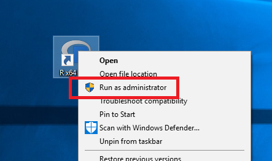

<p align="center">
[](https://github.com/datproject/design)

[](https://travis-ci.org/libscie/datr)
[](https://codecov.io/github/libscie/datr?branch=master)
</p>

The goal of datr is to provide R users with an easy way to interact with the [Dat](https://datproject.org) p2p infrastructure. Please note that this project is released with a [Contributor Code of Conduct](CONDUCT.md). By participating in this project you agree to abide by its terms.

## Installation

You can install `datr` from GitHub with:

``` r
# install.packages("devtools")
devtools::install_github("libscie/datr")
```

See below for [Windows](#windows), [Mac](#mac), and [Linux](#linux) specific instructions for installing Dat.

### Windows

Fire up `R` *with* Administrator privileges by right clicking the icon and selecting "Run as administrator"

[](https://winaero.com/blog/how-to-run-an-app-as-administrator-in-windows-10/)

Once the program launches, run `datr::dat_install()`. The package then initiates downloading Dat and installs it on your local machine. 

Upon completion, reboot R and you can start using the package 😻 (adminstrator privileges no longer needed)

### Mac

**TO BE ADDED**

### Linux

Run `datr::dat_install(os = 'linux')` from your R console. There's no need to specify which flavor of Linux you're running, but you might to need to restart your R session 🙋

## Example

TO BE ADDED: This is a basic example which shows you how to solve a common problem:

``` r
## basic example code
```

## Code of conduct

## License

All code is licensed GPLv3. All non-code assets are available under a [CC 0 Public Domain Dedication](https://creativecommons.org/publicdomain/zero/1.0/legalcode).
